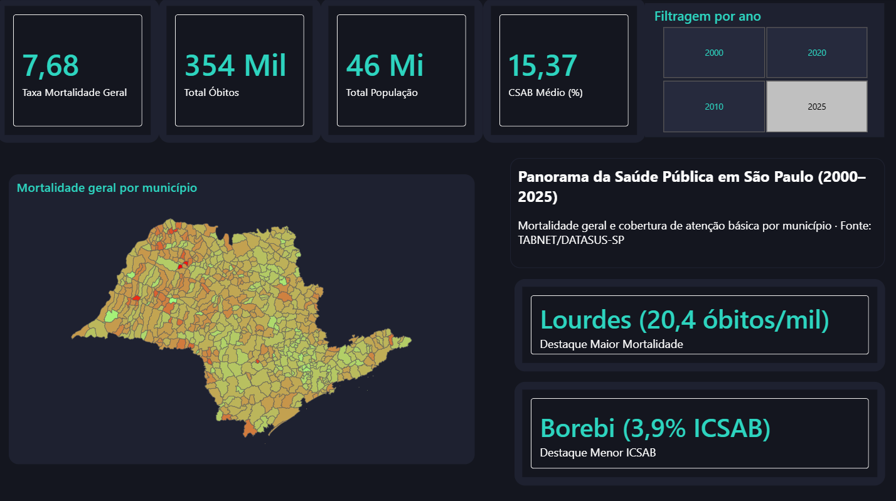
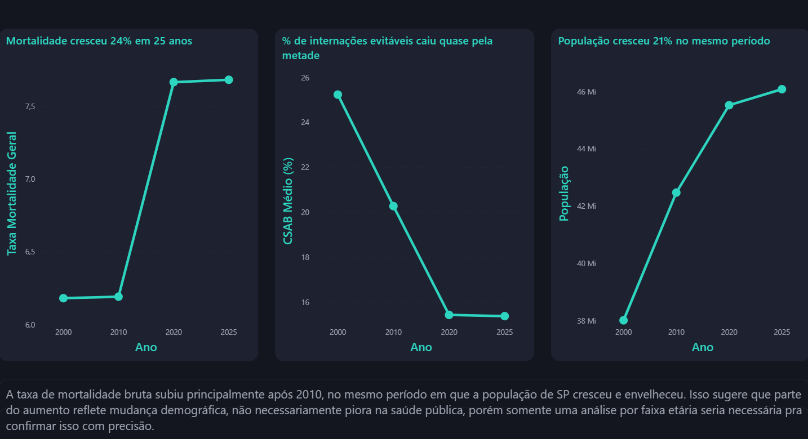
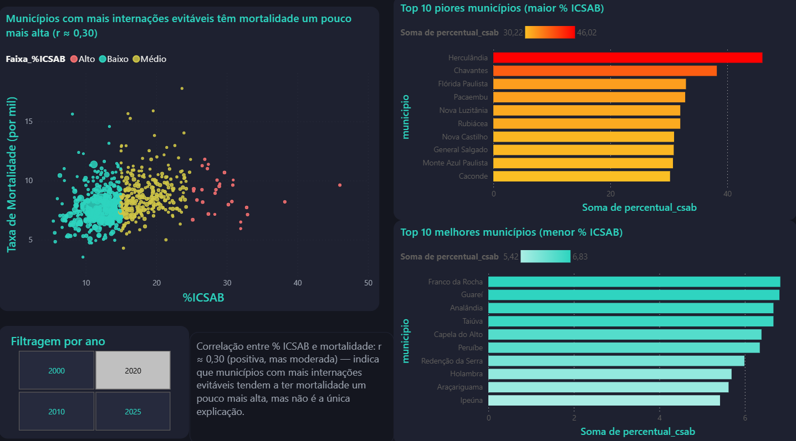

# Panorama da Saúde Pública em São Paulo (2000–2025)

Dashboard interativo em Power BI que investiga a relação entre a cobertura de atenção básica e a mortalidade geral nos 645 municípios do estado de São Paulo, ao longo de 25 anos.

## Pergunta de pesquisa

**Municípios com melhor cobertura de atenção básica apresentam menor mortalidade?**

A hipótese testada é que a população pode reduzir sua dependência de internações hospitalares — e, por consequência, a mortalidade por causas evitáveis — quando tem acesso adequado a cuidados preventivos básicos (postos de saúde, agentes comunitários, pré-natal, vacinação).

Para medir isso, o projeto usa o **ICSAB/ICSAP** (Internações por Condições Sensíveis à Atenção Básica) — indicador oficial do Ministério da Saúde que estima o percentual de internações hospitalares que poderiam ter sido evitadas com atenção básica adequada.

## Fontes de dados

Todos os dados são públicos, extraídos via TABNET:

| Base | Fonte | Sistema de origem |
|---|---|---|
| Mortalidade geral | [TABNET/DATASUS-SP](https://www.saude.sp.gov.br/links/informacoes-de-saude-tabnet) | SIM (Sistema de Informação sobre Mortalidade) |
| População residente | [TABNET/DATASUS](https://www.saude.sp.gov.br/links/informacoes-de-saude-tabnet) | Estimativas populacionais IBGE |
| % ICSAB | [Matriz de Indicadores de Saúde SP](https://www.saude.sp.gov.br/links/matriz) | SIH-SUS, indicador 42 |

**Períodos analisados:** 2000, 2010, 2020 e 2025 (dados de 2023–2026 são classificados como preliminares pela fonte).

## O que o dashboard mostra

### Página 1 — Visão Geral
KPIs gerais do estado, mapa coroplético de mortalidade por município (645 municípios, malha geográfica em TopoJSON/IBGE) e destaques dinâmicos do município com maior mortalidade e melhor cobertura de atenção básica no ano selecionado.

### Página 2 — Evolução Temporal

Como mortalidade, % ICSAB e população evoluíram entre 2000 e 2025.

### Página 3 — Correlação

Dispersão entre % ICSAB e taxa de mortalidade por município, com ranking dos 10 municípios com melhor e pior indicador.

## Principais achados

- A **taxa de mortalidade bruta** subiu de 6,18 para 7,68 óbitos/mil habitantes (+24%) entre 2000 e 2025, com o maior salto ocorrendo após 2010.
- No mesmo período, o **% médio de internações evitáveis (ICSAB) caiu de ~25% para ~15%** — uma melhora consistente na cobertura de atenção básica.
- A **população do estado cresceu 21%** (38 para 46 milhões) no mesmo intervalo — parte do aumento na mortalidade bruta provavelmente reflete envelhecimento populacional, não necessariamente piora nos serviços de saúde. Uma análise por faixa etária seria necessária para isolar esse efeito.
- Existe uma **correlação positiva, porém fraca a moderada** (r ≈ 0,30) entre % ICSAB e mortalidade por município: municípios com mais internações evitáveis tendem a ter mortalidade um pouco mais alta, mas a atenção básica está longe de ser o único fator — a maior parte da variação de mortalidade entre municípios se explica por outras causas.

## Limitações metodológicas

- A taxa de mortalidade usada é **bruta**, não ajustada por estrutura etária — municípios mais envelhecidos tendem a ter taxas mais altas independentemente da qualidade da atenção básica.
- Correlação não implica causalidade: o r ≈ 0,30 indica associação, não que o ICSAB "explique" a mortalidade.
- Municípios muito pequenos podem ter indicadores instáveis ano a ano por baixo volume de casos.

## Ferramentas e técnicas utilizadas

- **Power BI Desktop** — modelagem de dados, DAX, Power Query
- **Power Query (M)** — limpeza, padronização de município via código IBGE, tratamento de dados ausentes
- **DAX** — medidas de taxa, médias ponderadas e destaques dinâmicos via `TOPN`/`SUMMARIZE`
- **Mapa de Formas (Shape Map)** — malha TopoJSON customizada dos 645 municípios de SP
- **Python/pandas** — consolidação inicial e validação cruzada dos dados extraídos do TABNET (conferência de somas contra os totais oficiais de cada base)

## Como reproduzir

1. Baixe os dados diretamente no [TABNET/DATASUS-SP](https://www.saude.sp.gov.br/links/informacoes-de-saude-tabnet), nas seções "Eventos Vitais → Mortalidade", "População Residente" e na [Matriz de Indicadores](https://www.saude.sp.gov.br/links/matriz), item 42
2. Abra o arquivo `.pbix` no Power BI Desktop (versão atualizada, necessária para o visual Mapa de Formas)
3. Atualize as fontes de dados conforme necessário em Power Query

## Autor

Projeto desenvolvido como parte de portfólio em análise de dados.

[[LinkedIn](https://www.linkedin.com/in/matheus-felipe-luiz-550a321a0/)] · [GitHub](https://github.com/Math1901)

---

*Dados públicos. Este projeto tem fins educacionais e de portfólio — não substitui análise epidemiológica oficial.*
